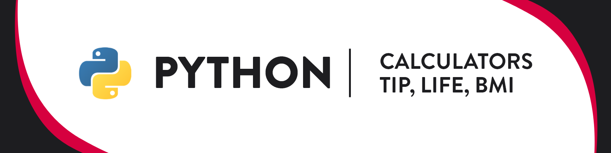
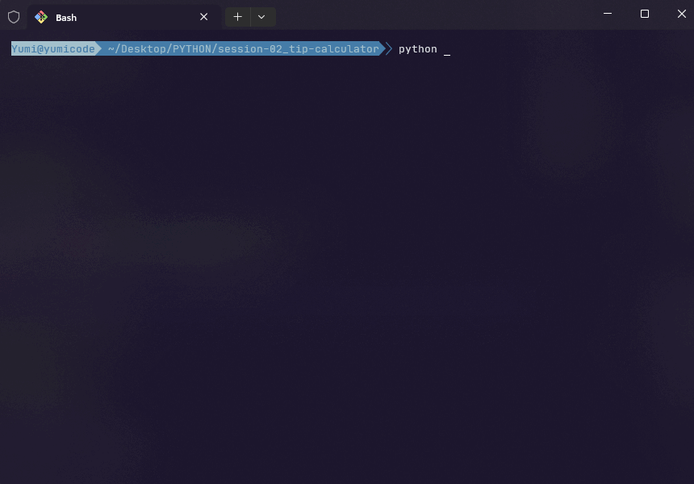
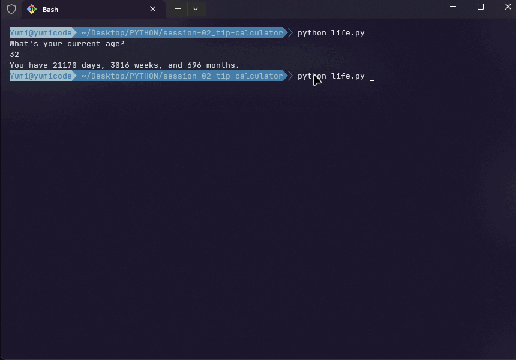
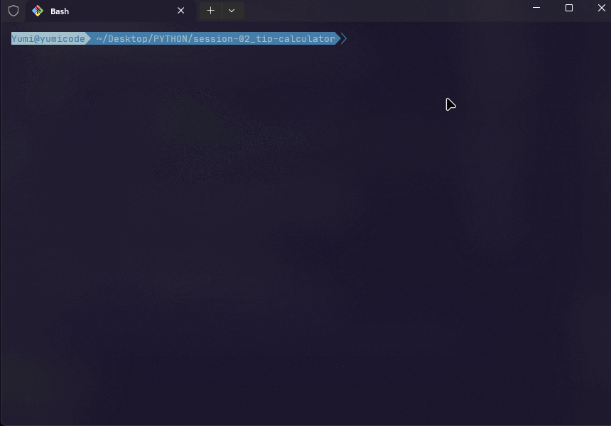
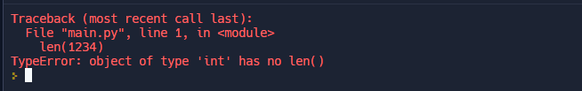
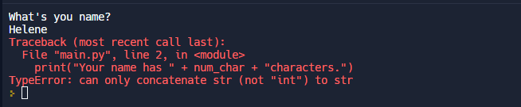

# Python journey



## Introduction

For this session, we'll learn data types to create a tip calculator.

## Summary

- [Requirements](#requirements)
- [Tools and version](#tools-and-versions)
- [Project: BMI calculator, Tip calculator](#project)
- [Some tips](#tips)

- Useful resources :

- [Sources](#sources)

## Requirements

Python installed and an IDE or online editor like: <https://replit.com/>

## Tools and versions

- OS
  - Linux OS -
  - Windows OS -

- IDE
  - VSCodium v1.77.3

- Techno
  - Python v3.11.3

## Project

### BMI calculator

```python
height = input("Enter your height in meters: ")
weight = input("Enter your weight in kg: ")
bmi = int(weight) /(float(height) ** 2)

print(int(bmi))
```



### Time remaining

```python
age = input("What's your current age? \n")
max_age = 90

age_in_int = int(age)
years_remaining = (max_age - age_in_int)
days_remaining = years_remaining * 365
weeks_remaining = years_remaining * 52
months_remaining = years_remaining * 12

message = f"You have {days_remaining} days, {weeks_remaining} weeks, and {months_remaining} months."

print(message)
```



### Tip calculator

Exercise:

- Output a greeting message
- Ask for total bill
- Ask for how many percentage tip you'd like to give
- Ask fo how many people to split the bill
- Give the amount of each person should pay with only 2 digits

```python
print("Welcome to the tip calculator!")

total_bill = float(input("What was the total bill? \n$"))

percent_tip = int(input("What percentage tip would you like to give? 10, 12, or 15? "))

people = int(input("How many people to split the bill?"))

total_bill_tip = total_bill * (percent_tip/100) + total_bill

total_for_each = total_bill_tip / people

# total_rounded = round(total_for_each, 2)
total_rounded = "{:.2f}".format(total_for_each)

print(f"The amount for each people is ${total_rounded}")
```



## Tips

### Data types

- Strings

String of characters:

```py
print("Hello"[2])
# output "l"
```

- Integer

Declare an integer by write the number without anything else

```py
print(1+2)
```

For big numbers, you can add "_"

```py
123_456

#same as 123456
```

- Float

```py
3.14159
```

- Boolean

Basic true or false value

### Type Error, Type Checking and Type conversion

- len() function doesn't like working with integer



- concatenation works only with strings

```py
num_char = len(input("What's you name? \n"))
print("Your name has " + num_char + "characters.")
```



- Check type

Use type function to investigate which type you have

```py
type(what to check)
```

- Convert into string

```py
str(object_to_convert)
```

- Division in Python always give floating number

### Mathematical operations

```python
1 + 2
2 - 3
3 * 4
4 / 5
5 ** 6
```

Remember PEMDAS = order of priority

```sh
Parentheses
Exponents
Multiplication
Division
Addition
Substraction
```

- round() function to round number

```python
round(number, nb_digits after point)
round(2.66666, 2)
```

### F Strings

```python
score = 0
height = 1.5
isWinning = True

print(f"your score is {score}, your height is {height} and, you are winning is {isWinning}")
```

Avoid converting everything, use variables by adding "f" before "quotation marks"

---

## Sources
